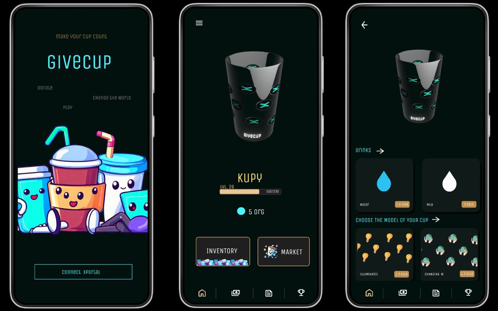

# Introducing GiveCup 🌍
**Building communities around causes.**

GiveCup is a gamified Web3 based mobile app revolutionizing charitable donations, built from first principles for the X Day /hackathon on the MultiversX blockchain.

We make donations secure, transparent, and rewarding, striving to create a personal connection between the donor and the organization.

## 🎥 Demo

 

## 📁 Repositories

### [client](https://github.com/GiveCup/client) :iphone:
🎮 **Mobile App** 
- **Technologies**: React Native, Web3, Expo, MultiversX, TypeScript
- **Description**: A gamified web3 app that turns donations into a secure, transparent, and rewarding experience.

### [sc-dynamic-rs](https://github.com/GiveCup/sc-dynamic-rs) :sparkles:
🖼️ **Dynamic NFTs Smart Contract**: Handles a dynamic NFT implementation built for our platform.

### [sc-donations-rs](https://github.com/GiveCup/sc-donations-rs) :heart:
❤️ **Donations Smart Contract**: Heart of our donation mechanism on the MultiversX blockchain. Whether you're giving directly or through quadratic funding, this contract handles it.

### [genezio](https://github.com/GiveCup/genezio) :cloud:
☁️ **Serverless Module**: Our Genezio implementation ensuring efficient serverless operations. *WIP

### [api](https://github.com/GiveCup/api) :computer:
🌐 **API Client**: Crafted with Express.js, it's the bridge between our frontend and the various backend functionalities.

## 🖼 App Preview

## 🚀 Features
- **Gamified Giving**: Transform your charitable donations into a game-like experience. Donate, level up, and unlock unique rewards.
- **Blockchain Transparency**: Every transaction is securely documented on the MultiversX blockchain, ensuring a traceable ledger of your contributions.
- **Security First**: Support verified NGOs and be confident that your contributions are safeguarded against fraud.
- **Dynamic NFT**: Your entrance ticket is a customizable NFT cup. Decorate it, enhance its value, and then donate its worth to an organization you're passionate about.
- **Rankings & In-app Updates**: Keep track of your progress and receive regular updates within the app.
- **Simple Donation Process**: Choose an NGO, donate the value of your NFT cup, earn XP, and watch your contributions make a difference.

## 🌐 Relevant Links

- [Website](https://givecup.io)
- [Pitch Deck](./.github/pitch.pdf)
- [Demo Video](https://youtu.be/f6Cd2hSYgWM)
